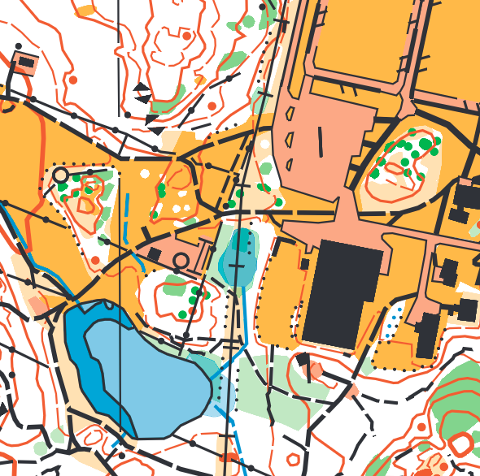
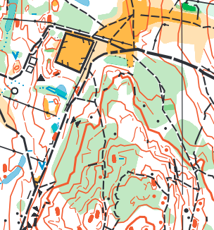
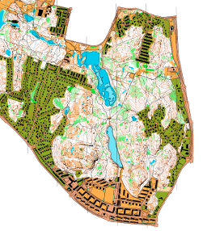

OCAD to GeoJSON
===============

Export [OCAD](https://www.ocad.com/) files to open formats:

* [GeoJSON](http://geojson.org/)
* [Mapbox Style Spec](https://www.mapbox.com/mapbox-gl-js/style-spec/)
* SVG
* PDF





Demo: [OCAD map viewer and converter in your browser](https://www.liedman.net/ocad2geojson/)

You can use this to get geo/GIS data out of an OCAD file. This is currently more or less four modules
working together:

* _OCAD file reader_, to get meaningful data out of the binary OCAD files
* _OCAD to GeoJSON_, to export the geographic objects from OCAD files
* _OCAD to SVG_, to export the map to vector graphics; SVG can then also easily be used to produce PDFs 
* _OCAD to Mapbox GL style_, to get the styling (colors, line widths, etc.) into something you can
  use with other tools

OCAD version 10, 11 and 12 and 2018 files are mostly supported. Some OCAD features are currently not fully supported:

* Hatch fills are not supported when exported to Mapbox styles and emulated by semi-transparent fills
* Fill patterns are ~~not supported~~ supported for SVG and PDF exports
* ~~Curves are not supported~~ Bezier curves now supported!
* ~~Some texts are not exported~~
* SVG / PDF currently lack any text
* ...and probably a lot more that I do not even know is missing

Feel free to open issues for lacking features - I will not promise to add them, but good to keep track of what is missing.

Have you built something with this module, or want to help out improving it? I'd love to know; open an issue, pull request or contact [per@liedman.net](mailto:per@liedman.net).

## Usage

```js
const { readOcad, ocadToGeoJson, ocadToMapboxGlStyle } = require('../')

readOcad(filePath)
  .then(ocadFile => {
    const geojson = ocadToGeoJson(ocadFile)
    console.log(JSON.stringify(geojson))
    const layerStyles = ocadToMapboxGlStyle(ocadFile)
    console.log(JSON.stringify(layerStyles))
  })
```

The argument to `readOcad` can either be a file path (string) or a `Buffer` object.

I will try to write some docs, in the meantime, check out the [demo directory](demo) for some examples of how to use this module.

## Command line

There is also a command line utility in `cli.js` which you can look at and use, but docs will have to wait.

## License

Since I highly dislike the closed source nature of some of the software used in orienteering (well, mostly OCAD),
this software is licensed under [AGPL-3.0](LICENSE); in short, to use this software, you must distribute source.
